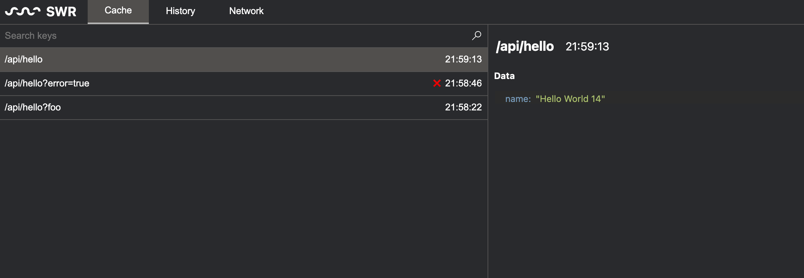

# swr-devtools

[](https://github.com/koba04/swr-devtools/actions?workflow=lint)




**This only supports SWR v1 or later versions.**

## How to use

### Install the SWRDevTools extension

- Chrome
    - https://chrome.google.com/webstore/detail/swr-devtools/liidbicegefhheghhjbomajjaehnjned
- Firefox
    - https://addons.mozilla.org/en-US/firefox/addon/swr-devtools/

### Wrap your application in the SWRDevTools component

```shell
npm install swr-devtools
# Install peerDependencies
npm install react swr
```

```jsx
import ReactDOM from "react-dom";
import { SWRDevTools } from "swr-devtools";

ReactDOM.render(
  <SWRDevTools>
    <MainApp />
  </SWRDevTools>,
  document.getElementById("app")
);
```
## Packages

| package                                                       | description                                  |
| ------------------------------------------------------------- | -------------------------------------------- |
| [swr-devtools](./packages/swr-devtools)                       | A React component to inject your application |
| [swr-devtools-extensions](./packages/swr-devtools-extensions) | A Chrome extension for the SWR DevTools      |
| [swr-devtools-panel](./packages/swr-devtools-panel)           | A React component for the SWR DevTools panel |

## Online Demo

https://swr-devtools.vercel.app

## LICENSE

[MIT](LICENSE.md)
